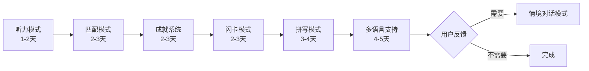

# Phase C: Advanced Learning Modes and Features
## C阶段：高级学习模式和功能

> **当前状态**: Phase B 已完成
> - ✅ A.1: 词性缩写 (verbe → v.)
> - ✅ A.2: 看图选单词练习模式（4选1）
> - ✅ B.1: 星星积分系统
> - ✅ B.2: 基础国际化（中文+英文）

---

## 目标概览

Phase C 将实现以下三个主要目标：

### C.1 多种练习模式 🎯
提供多样化的学习方式，适应不同学习者的需求和偏好

### C.2 成就系统 🏆
增强学习动力，通过游戏化元素提升用户粘性

### C.3 完整多语言支持 🌍
扩大用户群体，支持11种语言界面

---

## C.1 多种练习模式

### 优先级排序
1. **听力模式** ⭐⭐⭐⭐⭐ (最快见效)
2. **匹配模式** ⭐⭐⭐⭐⭐ (适合儿童，趣味性强)
3. **闪卡模式** ⭐⭐⭐⭐⭐ (核心学习方式)
4. **拼写模式** ⭐⭐⭐⭐ (深度练习)
5. **情境对话模式** ⭐⭐ (长期规划)

---

### C.1.1 听力模式 (Listening Mode) 🎧

#### 功能描述
```
播放单词发音 → 用户猜测单词（4选1）
```

#### 核心特性
- 🔊 播放目标单词的法语发音
- 🔁 可重复播放（最多3次）
- 📊 4选1选择题界面
- ✅ 即时反馈（正确/错误）
- ⭐ 完成后获得积分奖励

#### UI设计
```
┌─────────────────────────┐
│   🎧 听力练习            │
│                         │
│   [🔊 播放发音]          │
│   (可点击重复播放)        │
│                         │
│   Choisissez le mot:    │
│                         │
│  ┌─────────────────┐   │
│  │ A. la pomme     │   │
│  └─────────────────┘   │
│  ┌─────────────────┐   │
│  │ B. le chat      │   │
│  └─────────────────┘   │
│  ┌─────────────────┐   │
│  │ C. le livre     │   │
│  └─────────────────┘   │
│  ┌─────────────────┐   │
│  │ D. la table     │   │
│  └─────────────────┘   │
│                         │
│  播放次数: 1/3          │
│  进度: 5/20  正确率: 80%│
└─────────────────────────┘
```

#### 技术实现要点
- **复用现有组件**:
  - `PracticeView` 的4选1界面
  - `AudioPlayerManager` 播放音频
  - `PracticeViewModel` 管理状态
- **新增功能**:
  - 播放次数计数器
  - 自动播放第一次
  - 重播按钮
- **数据依赖**:
  - 依赖现有的单词音频文件（AudioSegment）

#### 积分规则
- 一次正确: +3 stars
- 两次正确: +2 stars
- 三次正确: +1 star
- 答错: 0 stars

#### 预估工作量
**1-2天** (简单实现，复用现有代码)

#### 实现步骤
1. 创建 `ListeningPracticeView.swift`
2. 复用 `PracticeViewModel`，添加播放次数跟踪
3. 修改UI：移除图片，添加播放按钮
4. 实现播放次数限制逻辑
5. 添加本地化字符串
6. 在学习模式选择界面添加入口

---

### C.1.2 闪卡模式 (Flashcard Mode) 💳

#### 功能描述
```
看图片/单词 → 回忆释义 → 翻转查看答案 → 标记认识/不认识
```

#### 核心特性
- 🖼️ 图片正面，法语单词背面
- 🔄 点击翻转卡片（流畅动画）
- ✅ 标记"认识"/"不认识"
- 📅 基于Leitner系统的间隔重复
- 📊 复习队列管理

#### UI设计
```
┌─────────────────────────┐
│   📚 闪卡学习            │
│                         │
│  ┌─────────────────┐   │
│  │                 │   │
│  │   [图片: 苹果]   │   │ ← 正面
│  │                 │   │
│  │  (点击翻转)      │   │
│  └─────────────────┘   │
│                         │
│  ┌─────────────────┐   │
│  │ ✅ 认识         │   │
│  └─────────────────┘   │
│  ┌─────────────────┐   │
│  │ ❌ 不认识       │   │
│  └─────────────────┘   │
│                         │
│  剩余: 15  今日新卡: 5  │
└─────────────────────────┘

[翻转后]
┌─────────────────────────┐
│   📚 闪卡学习            │
│                         │
│  ┌─────────────────┐   │
│  │   la pomme      │   │ ← 背面
│  │   (f.)          │   │
│  │                 │   │
│  │   🔊 [播放]      │   │
│  │                 │   │
│  │   苹果          │   │
│  └─────────────────┘   │
│                         │
│  ┌─────────────────┐   │
│  │ ✅ 认识         │   │
│  └─────────────────┘   │
│  ┌─────────────────┐   │
│  │ ❌ 不认识       │   │
│  └─────────────────┘   │
└─────────────────────────┘
```

#### Leitner间隔重复算法

**盒子系统（5个盒子）：**
- **Box 1**: 每天复习 (新卡片)
- **Box 2**: 2天后复习
- **Box 3**: 4天后复习
- **Box 4**: 7天后复习
- **Box 5**: 14天后复习 (已掌握)

**规则：**
- ✅ 认识 → 移到下一个盒子
- ❌ 不认识 → 回到 Box 1

#### 数据模型
```swift
class FlashcardProgress {
    var wordId: String
    var boxNumber: Int // 1-5
    var lastReviewDate: Date
    var nextReviewDate: Date
    var reviewCount: Int
    var correctCount: Int
}
```

#### 技术实现要点
- **新建组件**:
  - `FlashcardView.swift` - 主视图
  - `FlashcardCard.swift` - 可翻转卡片组件
  - `FlashcardViewModel.swift` - 状态管理
  - `FlashcardProgress` 模型 - 进度跟踪
- **核心功能**:
  - 3D翻转动画 (rotation3DEffect)
  - 队列管理（今日应复习的卡片）
  - 间隔重复调度算法
- **复用**:
  - 图片资源 (imageName)
  - 音频播放 (AudioPlayerManager)

#### 积分规则
- 第一次认识: +5 stars
- 从Box 4升到Box 5: +10 stars (已掌握)
- 完成每日复习目标: +15 stars

#### 预估工作量
**2-3天** (中等复杂度，需要新数据模型和算法)

#### 实现步骤
1. 创建 `FlashcardProgress` 数据模型
2. 实现间隔重复算法
3. 创建翻转卡片UI组件
4. 创建 `FlashcardView` 主界面
5. 实现队列管理逻辑
6. 添加进度跟踪和统计
7. 添加本地化字符串

---

### C.1.3 拼写模式 (Spelling Mode) ⌨️

#### 功能描述
```
看图片/听发音 → 用户输入法语单词 → 检查拼写
```

#### 核心特性
- ⌨️ 文本输入框（支持法语特殊字符）
- 🎯 智能拼写检查（支持重音符号）
- 💡 提示系统（首字母、单词长度、逐步揭示）
- 🔊 可选：听发音模式
- ✅ 自动填充重音符号工具栏

#### UI设计
```
┌─────────────────────────┐
│   ⌨️ 拼写练习            │
│                         │
│  [图片: 苹果]            │
│  🔊 播放发音             │
│                         │
│  Écrivez le mot:        │
│  ┌─────────────────┐   │
│  │ [输入框]        │   │
│  └─────────────────┘   │
│                         │
│  特殊字符快捷键:         │
│  [à] [â] [é] [è] [ê]   │
│  [ë] [î] [ï] [ô] [û]   │
│  [ù] [ü] [ç]           │
│                         │
│  提示系统:              │
│  💡 首字母提示          │
│  💡 显示长度 (_ _ _ _)  │
│  💡 显示一个字母        │
│                         │
│  进度: 5/20  正确率: 75%│
└─────────────────────────┘
```

#### 拼写检查算法
```swift
func checkSpelling(input: String, correct: String) -> SpellingResult {
    // 1. 完全匹配
    if input == correct {
        return .correct
    }

    // 2. 忽略大小写
    if input.lowercased() == correct.lowercased() {
        return .correctWithCase
    }

    // 3. 忽略重音符号
    let inputNormalized = input.folding(options: .diacriticInsensitive)
    let correctNormalized = correct.folding(options: .diacriticInsensitive)
    if inputNormalized == correctNormalized {
        return .missingAccents
    }

    // 4. 小错误（1-2个字符）
    let distance = levenshteinDistance(input, correct)
    if distance <= 2 {
        return .closeMatch(distance)
    }

    return .incorrect
}
```

#### 提示系统
- **Level 1**: 显示单词长度 (p _ _ _ _)
- **Level 2**: 显示首字母 (p o _ _ _)
- **Level 3**: 显示元音 (p o _ _ e)
- **Level 4**: 显示完整单词

#### 技术实现要点
- **UI组件**:
  - 法语特殊字符键盘工具栏
  - 动态反馈（实时拼写提示）
- **算法**:
  - Levenshtein距离算法（相似度检测）
  - 重音符号规范化
- **用户体验**:
  - 渐进式提示
  - 鼓励性反馈

#### 积分规则
- 无提示正确: +5 stars
- 1个提示正确: +3 stars
- 2个提示正确: +2 stars
- 3个提示正确: +1 star
- 使用完整提示: 0 stars

#### 预估工作量
**3-4天** (较复杂，需要输入处理和算法)

#### 实现步骤
1. 创建 `SpellingPracticeView.swift`
2. 实现法语特殊字符键盘工具栏
3. 实现拼写检查算法
4. 实现渐进式提示系统
5. 添加输入验证和反馈
6. 优化用户体验（自动聚焦、键盘管理）
7. 添加本地化字符串

---

### C.1.4 匹配模式 (Matching Game) 🎮

#### 功能描述
```
图片与单词配对游戏（翻牌记忆游戏）
```

#### 核心特性
- 🎴 卡片翻转配对（经典记忆游戏）
- 🖼️ 图片与法语单词配对
- ⏱️ 计时功能（可选）
- ⭐ 积分奖励系统
- 👶 特别适合儿童学习者
- 🎨 生动的动画效果

#### UI设计
```
┌─────────────────────────────┐
│   🎮 配对游戏  ⏱️ 00:45      │
│                             │
│  ┌─────┐ ┌─────┐ ┌─────┐  │
│  │  ?  │ │  ?  │ │  ?  │  │ ← 卡片背面
│  └─────┘ └─────┘ └─────┘  │
│  ┌─────┐ ┌─────┐ ┌─────┐  │
│  │🍎   │ │  ?  │ │pomme│  │ ← 翻开的卡片
│  └─────┘ └─────┘ └─────┘  │
│  ┌─────┐ ┌─────┐ ┌─────┐  │
│  │  ?  │ │  ?  │ │  ?  │  │
│  └─────┘ └─────┘ └─────┘  │
│  ┌─────┐ ┌─────┐ ┌─────┐  │
│  │  ?  │ │  ?  │ │  ?  │  │
│  └─────┘ └─────┘ └─────┘  │
│                             │
│  配对成功: 2/6  ⭐ 得分: 60 │
└─────────────────────────────┘
```

#### 游戏规则
1. **卡片数量**: 12张卡片（6对）
2. **配对方式**:
   - 图片 ↔ 法语单词
   - 例如：苹果图片 ↔ "pomme"
3. **翻牌规则**:
   - 每次可翻开2张卡片
   - 如果配对成功，卡片保持翻开状态
   - 如果不匹配，卡片翻回背面
4. **完成条件**: 所有卡片配对成功

#### 积分规则
- 第一次尝试配对成功: +10 stars
- 第二次尝试配对成功: +7 stars
- 第三次及以上: +5 stars
- 时间奖励:
  - 1分钟内完成: 额外 +20 stars
  - 2分钟内完成: 额外 +10 stars
  - 3分钟内完成: 额外 +5 stars

#### 数据模型
```swift
struct MatchingCard: Identifiable {
    let id = UUID()
    let word: Word
    let type: CardType // .image 或 .text
    var isFaceUp: Bool = false
    var isMatched: Bool = false
}

enum CardType {
    case image  // 显示图片
    case text   // 显示法语单词
}

class MatchingGameViewModel: ObservableObject {
    @Published var cards: [MatchingCard]
    @Published var selectedCards: [MatchingCard] = []
    @Published var matchedPairs: Int = 0
    @Published var attempts: Int = 0
    @Published var elapsedTime: TimeInterval = 0
    @Published var score: Int = 0

    func selectCard(_ card: MatchingCard)
    func checkForMatch()
    func resetGame()
}
```

#### 技术实现要点
- **UI组件**:
  - `MatchingGameView.swift` - 主游戏界面
  - `MatchingCardView.swift` - 单个卡片组件
  - `MatchingGameViewModel.swift` - 游戏逻辑
- **动画**:
  - 3D翻转动画 (rotation3DEffect)
  - 配对成功动画 (scale + opacity)
  - 配对失败抖动动画
- **复用**:
  - Word模型的图片资源
  - PointsManager积分系统

#### 预估工作量
**2-3天** (中等复杂度)

#### 实现步骤
1. 创建 `MatchingCard` 和 `MatchingGameViewModel`
2. 实现卡片洗牌算法
3. 创建 `MatchingCardView` 翻转动画
4. 创建 `MatchingGameView` 主界面
5. 实现配对检测逻辑
6. 添加计时器和积分系统
7. 添加完成动画和结果页面
8. 添加本地化字符串
9. 在学习模式选择界面添加入口

---

### C.1.5 情境对话模式 (Contextual Dialogue) 💬

#### 功能描述
```
在句子中使用单词，更接近实际应用
```

#### 核心特性
- 📝 完整句子语境
- 🎯 填空练习
- 🗣️ 日常对话场景

#### UI设计
```
┌─────────────────────────┐
│   💬 情境对话            │
│                         │
│  场景: 在餐厅            │
│                         │
│  Je voudrais une ____   │
│  s'il vous plaît.       │
│                         │
│  选项:                  │
│  A. pomme               │
│  B. chat                │
│  C. livre               │
│  D. table               │
└─────────────────────────┘
```

#### 预估工作量
**4-5天** (需要大量句子内容准备)

**状态**: 长期规划，优先级较低

---

## C.2 成就系统 🏆

### 目标
通过游戏化机制增强学习动力和用户粘性

---

### 成就类别

#### 1️⃣ 学习里程碑
```
🏅 初学者 - 学习10个单词
🏅 学徒 - 学习50个单词
🏅 熟练者 - 学习100个单词
🏅 专家 - 学习200个单词
🏅 大师 - 学习500个单词
```

#### 2️⃣ 练习成就
```
🎯 新手射手 - 完成5次练习
🎯 熟练射手 - 完成20次练习
🎯 神射手 - 连续10次练习达到100%正确率
🎯 完美主义者 - 单次练习20题全对
```

#### 3️⃣ 连续学习
```
🔥 初学者 - 连续学习3天
🔥 坚持者 - 连续学习7天
🔥 学习狂 - 连续学习30天
🔥 传奇 - 连续学习100天
```

#### 4️⃣ 积分成就
```
⭐ 星星收集者 - 获得100星
⭐ 星辰大海 - 获得500星
⭐ 星光璀璨 - 获得1000星
```

#### 5️⃣ 探索成就
```
📚 探索者 - 解锁3个单元
📚 冒险家 - 解锁所有单元
📚 全能学霸 - 完成所有Section练习
```

#### 6️⃣ 特殊成就
```
🌅 早起鸟 - 早上6点前学习
🌙 夜猫子 - 晚上10点后学习
⚡ 闪电侠 - 单次练习用时少于2分钟
🎉 生日快乐 - 在生日当天学习
```

---

### 数据模型

```swift
enum AchievementType: String {
    case milestone
    case practice
    case streak
    case points
    case exploration
    case special
}

class Achievement {
    let id: String
    let title: String
    let description: String
    let icon: String
    let type: AchievementType
    let requirement: Int
    let points: Int
    var isUnlocked: Bool
    var unlockedDate: Date?
    var progress: Int // 当前进度
}

class UserAchievements {
    var achievements: [Achievement]
    var totalPoints: Int
    var unlockedCount: Int

    func checkAndUnlock(_ achievement: Achievement)
    func getProgress(_ achievement: Achievement) -> Double
}
```

---

### UI设计

#### 成就列表界面
```
┌─────────────────────────┐
│   🏆 成就               │
│                         │
│  总成就: 15/50          │
│  成就积分: 580          │
│                         │
│  📊 学习里程碑          │
│  ┌─────────────────┐   │
│  │ ✅ 🏅 初学者    │   │
│  │    学习10个单词  │   │
│  └─────────────────┘   │
│  ┌─────────────────┐   │
│  │ ✅ 🏅 学徒      │   │
│  │    学习50个单词  │   │
│  └─────────────────┘   │
│  ┌─────────────────┐   │
│  │ 🔒 🏅 熟练者    │   │
│  │    75/100       │   │
│  └─────────────────┘   │
│                         │
│  🎯 练习成就            │
│  ...                    │
└─────────────────────────┘
```

#### 成就解锁动画
```
[全屏弹窗]
┌─────────────────────────┐
│                         │
│       🎉 恭喜！          │
│                         │
│       🏅                │
│    成就已解锁！          │
│                         │
│      熟练者              │
│   学习100个单词          │
│                         │
│    +50 成就积分          │
│                         │
│   [太棒了]              │
└─────────────────────────┘
```

---

### 技术实现要点

1. **数据持久化**
   - 使用SwiftData保存成就进度
   - 每次练习后检查成就条件

2. **实时检测**
   - 在关键操作点触发检测：
     - 完成练习后
     - 学习新单词后
     - 每日登录时
     - 解锁新单元时

3. **动画效果**
   - 成就解锁动画（confetti效果）
   - 进度条动画
   - 图标弹跳动画

4. **通知系统**
   - 本地通知提醒用户连续学习
   - 成就即将达成提醒

---

### 预估工作量
**2-3天**

### 实现步骤
1. 创建 `Achievement` 和 `UserAchievements` 数据模型
2. 定义所有成就及其条件
3. 创建 `AchievementManager` 单例
4. 实现检测逻辑（在关键点触发）
5. 创建成就列表UI (`AchievementsView.swift`)
6. 实现解锁动画
7. 集成到Settings/Progress界面
8. 添加本地化字符串

---

## C.3 完整多语言支持 🌍

### 目标
支持11种语言，扩大全球用户群体

---

### 支持语言列表

| 语言 | 代码 | 优先级 | 市场规模 |
|------|------|--------|----------|
| ✅ 中文（简体） | zh-Hans | 已完成 | 大 |
| ✅ 英语 | en | 已完成 | 大 |
| 法语 | fr | 高 | 大 |
| 西班牙语 | es | 高 | 大 |
| 德语 | de | 高 | 中 |
| 日语 | ja | 中 | 中 |
| 韩语 | ko | 中 | 中 |
| 阿拉伯语 | ar | 中 | 大 (RTL) |
| 俄语 | ru | 低 | 中 |
| 葡萄牙语 | pt | 低 | 中 |
| 意大利语 | it | 低 | 小 |

---

### 实现策略

#### 第一阶段：西欧语言
**优先级：⭐⭐⭐⭐⭐**
- 法语 (fr)
- 西班牙语 (es)
- 德语 (de)
- 意大利语 (it)
- 葡萄牙语 (pt)

**工作量**: 2天
**理由**: 这些语言使用拉丁字母，翻译相对简单

---

#### 第二阶段：亚洲语言
**优先级：⭐⭐⭐⭐**
- 日语 (ja)
- 韩语 (ko)

**工作量**: 1天
**注意**: 需要测试UI布局（文字可能更长）

---

#### 第三阶段：RTL语言
**优先级：⭐⭐⭐**
- 阿拉伯语 (ar)

**工作量**: 2天
**注意**: 需要特殊处理RTL（从右到左）布局

---

#### 第四阶段：斯拉夫语言
**优先级：⭐⭐**
- 俄语 (ru)

**工作量**: 1天

---

### 需要翻译的内容

#### 1. 字符串文件
- 约 **120-150条** 翻译字符串
- 文件: `{language}.lproj/Localizable.strings`

#### 2. 关键界面元素
```
- Welcome View (欢迎界面)
- Main App View (主界面)
- Units View (单元界面)
- Practice View (练习界面)
- Settings View (设置界面)
- Progress View (进度界面)
- Menu View (菜单界面)
```

---

### 翻译工作流程

#### 方法1：AI辅助翻译（推荐）
```bash
# 使用GPT-4翻译所有字符串
1. 准备英文基准文件
2. 使用AI批量翻译
3. 人工审核关键术语
4. 测试界面效果
```

**优点**: 快速、成本低
**缺点**: 需要人工审核

#### 方法2：专业翻译服务
```
使用 Lokalise、Crowdin 等平台
```

**优点**: 质量高
**缺点**: 成本较高

---

### RTL（从右到左）支持

#### 阿拉伯语特殊处理

1. **布局镜像**
```swift
.environment(\.layoutDirection, .rightToLeft)
```

2. **文本对齐**
```swift
.multilineTextAlignment(.leading) // 自动适配RTL
```

3. **图标方向**
```swift
// 某些图标需要翻转（如箭头）
Image(systemName: "chevron.right")
    .environment(\.layoutDirection, .leftToRight) // 强制LTR
```

4. **测试要点**
- 导航流程是否正确
- 文本对齐是否合适
- 图标方向是否符合习惯

---

### 技术实现要点

1. **创建.lproj文件夹**
```
VocFr/
├── en.lproj/
│   └── Localizable.strings
├── zh-Hans.lproj/
│   └── Localizable.strings
├── fr.lproj/
│   └── Localizable.strings
├── es.lproj/
│   └── Localizable.strings
... (其他语言)
```

2. **更新Info.plist**
```xml
<key>CFBundleLocalizations</key>
<array>
    <string>en</string>
    <string>zh-Hans</string>
    <string>fr</string>
    <string>es</string>
    ...
</array>
```

3. **语言管理器**
```swift
extension AppLanguage {
    static var allCases: [AppLanguage] {
        [.english, .chinese, .french, .spanish,
         .german, .japanese, .korean, .arabic,
         .russian, .portuguese, .italian]
    }
}
```

---

### 预估工作量
**4-5天**
- 西欧语言: 2天
- 亚洲语言: 1天
- RTL语言: 2天

---

### 实现步骤

1. **准备翻译内容**
   - 导出所有英文字符串
   - 使用AI/人工翻译

2. **创建语言文件**
   - 为每种语言创建 `.lproj` 文件夹
   - 添加 `Localizable.strings`

3. **更新语言管理器**
   - 添加新语言选项
   - 更新 `AppLanguage` 枚举

4. **测试**
   - 每种语言的UI布局
   - RTL语言的特殊测试
   - 长文本的适配

5. **优化**
   - 调整UI以适应不同长度的文本
   - 确保所有图标和图片无文化冲突

---

## 总体实施计划

### 阶段划分

#### 第一阶段（快速见效 + 儿童友好）
**时间**: 5-7天
**内容**:
1. ✅ 听力模式 (1-2天)
2. ✅ 匹配模式 (2-3天) - **儿童友好，趣味性强**
3. ✅ 成就系统 (2-3天)

**优先级**: ⭐⭐⭐⭐⭐
**理由**: 快速提升学习体验，增强用户粘性，匹配游戏特别适合儿童学习者

---

#### 第二阶段（核心功能）
**时间**: 2-3天
**内容**:
1. ✅ 闪卡模式 (2-3天)

**优先级**: ⭐⭐⭐⭐⭐
**理由**: 提供重要的学习方式，适合记忆巩固

---

#### 第三阶段（深度练习）
**时间**: 3-4天
**内容**:
1. ✅ 拼写模式 (3-4天)

**优先级**: ⭐⭐⭐⭐
**理由**: 提供深度练习，提高拼写能力

---

#### 第四阶段（国际化）
**时间**: 4-5天
**内容**:
1. ✅ 完整多语言支持 (4-5天)

**优先级**: ⭐⭐⭐
**理由**: 扩大用户群体，但不影响核心功能

---

#### 第五阶段（可选功能）
**时间**: 待定
**内容**:
1. 情境对话模式

**优先级**: ⭐⭐
**理由**: 锦上添花的功能，可根据用户反馈决定是否实现

---

## 总工作量预估

| 功能模块 | 预估时间 | 优先级 |
|---------|---------|--------|
| 听力模式 | 1-2天 | ⭐⭐⭐⭐⭐ |
| 匹配模式 | 2-3天 | ⭐⭐⭐⭐⭐ |
| 成就系统 | 2-3天 | ⭐⭐⭐⭐⭐ |
| 闪卡模式 | 2-3天 | ⭐⭐⭐⭐⭐ |
| 拼写模式 | 3-4天 | ⭐⭐⭐⭐ |
| 多语言支持 | 4-5天 | ⭐⭐⭐ |
| 情境对话 | 4-5天 | ⭐⭐ |
| **总计** | **18-25天** | - |

---

## 推荐实施顺序



---

## 成功指标

### 用户参与度
- 每日活跃用户增长 **30%**
- 平均学习时长增加 **50%**
- 练习完成率提升到 **80%+**

### 学习效果
- 单词记忆留存率提升 **40%**
- 连续学习天数平均 **14天+**

### 用户满意度
- App Store评分达到 **4.5星+**
- 用户留存率（7天）达到 **60%+**
- 用户留存率（30天）达到 **40%+**

---

## 后续规划 (Phase D)

基于Phase C的成果，未来可考虑：

1. **社交功能** 👥
   - 好友系统
   - 排行榜
   - 学习小组

2. **个性化学习** 🎯
   - AI推荐学习内容
   - 自适应难度调整
   - 个人学习路径

3. **内容扩展** 📚
   - 更多单元和章节
   - 语法课程
   - 阅读材料

4. **高级功能** 🚀
   - 语音识别练习
   - AR卡片学习
   - 离线模式

---

**文档创建日期**: 2025-11-15
**最后更新**: 2025-11-15
**版本**: 1.0
